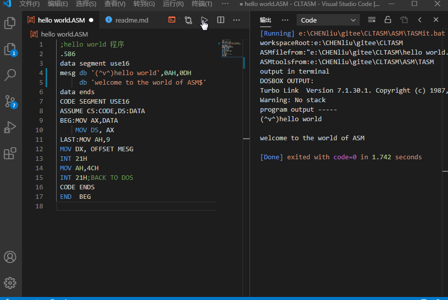
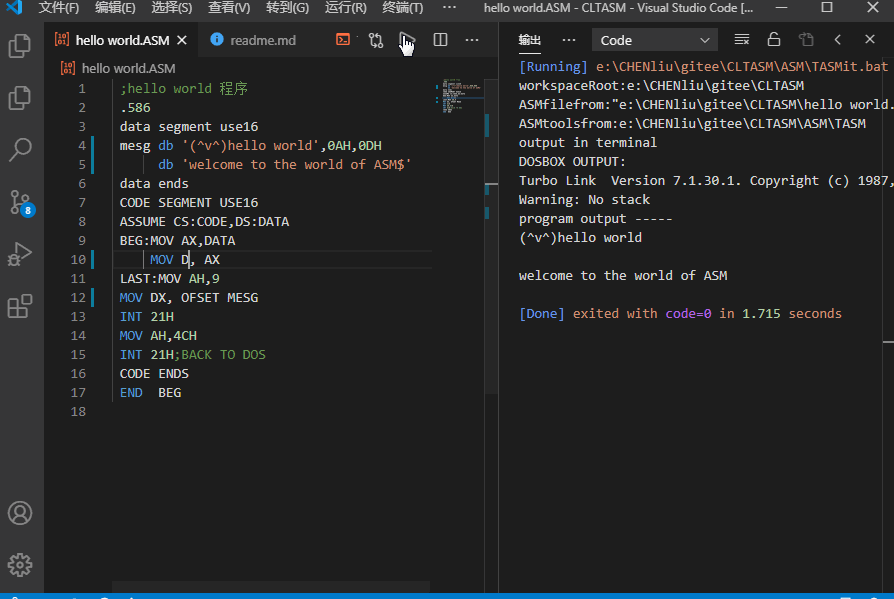
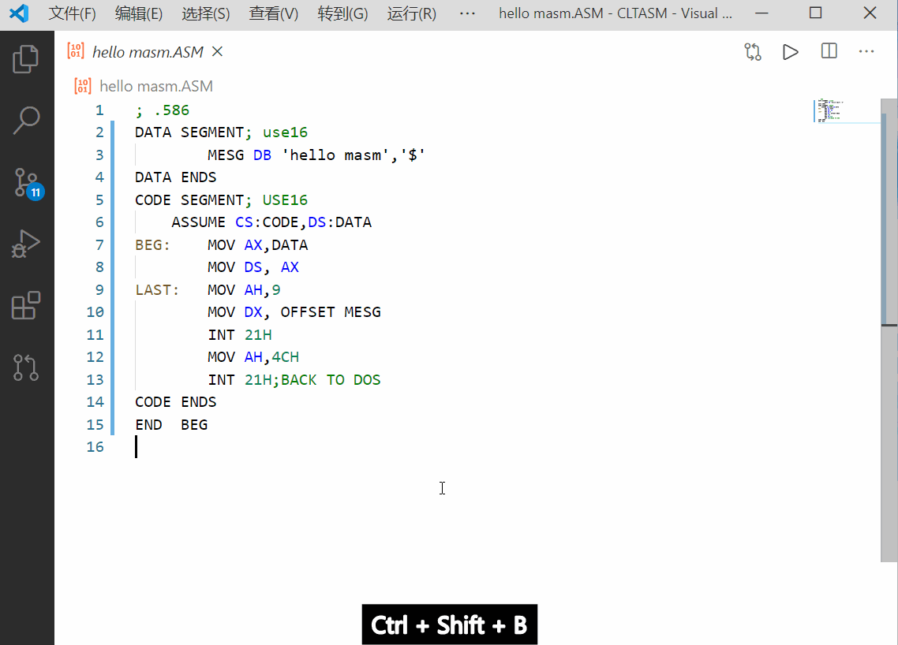

# ALL ABOUT TASM in DOSBox(notes?codes and vscode settings for run)

[中文](readme.md)|[github repo](https://github.com/xsrolau-liu/cltasm)|[gitee repo](https://gitee.com/chenliucx/CLTASM)

When I study the course <principles& peripheral technology of microprocessor>, I need to study some knowledge about assembly,but those assembly tools(TASM and MASM) runs in 16 bits microprocessor system which is not supported by most computers today. We use **DOSBox** to emulate the 16-bit environment, but DOSBox is designed for games,it is a little unfriendly for coding.So I write some **VSCode** settings and tasks to run the **TASM** assembly:smiley:

## :sweat_smile:Main Features

- if installed the vscode extension *code runner*, we can run tasm with a click or **Ctrl+Alt+N**
- we can also use the *vscode tasks* with **Ctrl+Shift+B**,to do more things

|Code Runner no error|Code Runner some error|terminal task|
|---|---|---|
||||

- :bulb: Also you can only copy the folder `ASMtools` and `.vscode` folders to your workspace with some changes to run your code

## :file_folder:Content

- Folder`tasm`:codes of TASM
- Folder`ASMtools`:windows programs of dosbox,TASM,and MASM
- Folder`.vscode`:tasks.json for Build Task,settings.json mainly for Coderunner
- Folder`notes`:some notes for reference in Chinese

## :raising_hand:Need your help

- The way to run code is runable but imperfect
- Codes still needed to collect more
- The notes is also not enough and out of order
- and other things
