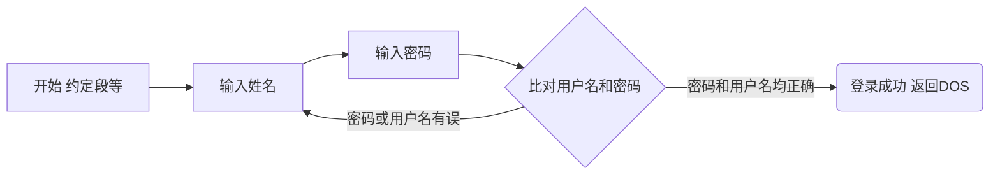

# 南邮实验题目
[toc]

### 实验1:排除错误，统计字符个数二进制显示exa131\exa209

[实验1.2]排除语法错误。

下面给出的是一个通过比较法完成8位二进制数转换成十进制数送屏幕显示功能
的汇编语言源程序,但有很多语法错误。要求实验者按照原样对源程序进行编辑，汇编后，根据MASM给出的错误信息对源程序进行修改，直到没有语法错误为止。然后进行链接,并执行相应的可执行文件。正确的执行结果是在屏幕上显示25 +9=34。

- 需要修改的代码   [EXA131-0.asm](EXA131-0.asm) 
- 大改之后的代码  [EXA131-1.ASM](EXA131-1.ASM) 
- 小改之后的代码   [EXA131-2.ASM](EXA131-2.ASM) 

[实验2.9] 从BUF单元开始存有一-字符串(长度<255)，编程实现统计该串字符中的ASCII码在42H~45H之间的字符个数，并将统计结果以一进制形式显示在屏幕上。

- 代码 [EXA209.ASM](EXA209.ASM) 
-  保存了符合要求的数据的代码的[EXA209A.ASM](EXA209A.ASM) 

### 实验2：用户登录程序exa318

[买验3.18]用户登录验证程序的实现。
程序执行后,给出操作提示，请用户输人用户名和密码;用户在输人密码时，程序不
回显输入字符;只有当用户输人的用户名、 密码字符串和程序内定的字符串相同时，才显示欢迎界面，并返回DOS。 界面颜色自定(彩色或黑白)。

- 基本完成所需功能，用户名不限定，密码初略比对[EXA318A.ASM](EXA318A.ASM)
- 系统中支持定义多个用户密码，[EXA318C](EXA318C.ASM)
- 系统中的界面得到了优化[EXA318E](EXA318E.ASM)
- 继续进行了部分优化后的版本 [exa318R1.ASM](exa318R1.ASM) 

被老师要求后修改程序流程之后的代码，使用宏来简化两个字符串的比较

- 在前者的基础上直接修改的版本 [exa318G.ASM](exa318G.ASM) 
- 重新编写使用宏的方法书写的版本 [exa318R2.ASM](exa318R2.ASM) 



```MERMAID
graph LR
l1(str1长度)-->j1{比较长度是否一致}
l2(str2长度)-->j1
j1-->|不一致|ed
j1-->|一致|j2
s1(str1首地址)-->j2{比较字符是否相等}
s2(str2首地址)-->j2
j2-->|字符相同|op[修改两个寄存器使之指向下一个字符]
j2-->|字符不同|ed(结束 字符串不等)
op-->|比较下一个字符|j2
j2-->|所有字符都相同|ed2(结束 字符串相等)
```
### 实验三：

#### 实验目的：
学习串行接口8250的工作原理及编程和中断程序的设计，运用微机系统串行通信知识，进行微机系统串行口的测试。
#### 实验要求
编写程序对微机系统的串行口进行自发自收内环测试，从键盘键入发送数据，屏幕显示接收数据。由于缺乏外环环境，因此本实验采用内环方式。发送要求采用查询方式，接收采用中断方式。
实验内容1：编写程序对微机系统的串口进行查询方式自发自收内环测试。
实验内容2：在查询方式的基础上，设计查询发送，中断方式接收的串行通信自发自收方式测试。

### 实验四：字符串动态显示

#### 实验目的：
学习8254的引脚、结构和应用，掌握8254初始化编程，掌握定时中断程序的设计。
#### 实验要求
利用系统定时源设计定时中断程序，每隔500 ms在系统机屏幕上显示一行字符串（字符串内容为各自学号，要求精确定时），按任意键程序结束。
- [基本实现所有功能了的代码](4A.ASM)
- 
#### 实验34，备选方案：音乐播放

 [MUSIC2.ASM](MUSIC2.ASM) 