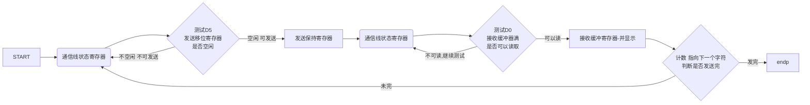
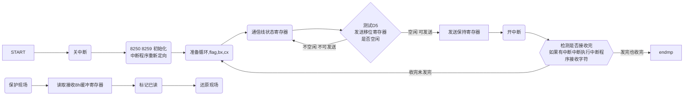

# 可编程串口通信芯片8250 编程

## 使用查询方式接收和发送30

```mermaid
graph LR
START-->DH1(通信线状态寄存器)
DH1-->20H{测试D5<br> 发送移位寄存器<br>是否空闲}
20H-->|空闲 可发送|8HS[发送保持寄存器]
20H-->|不空闲 不可发送|DH1
8HS-->DH2(通信线状态寄存器)
DH2-->01H{测试D0<br> 接收缓冲器满<br>是否可以读取}
01H-->|可以读|8HG[接收缓冲寄存器-并显示]
01H-->|不可读,继续测试|DH2
8HG-->INC{计数 指向下一个字符<br>判断是否发送完}
INC-->|未完|DH1
INC-->|发完|endp
```

## 使用查询方式发送和中断方式接收31

```mermaid
graph LR
START-->cli(关中断)
cli-->csh(8250 8259 初始化<br>中断程序重新定向)
csh-->loop(准备循环,flag,bx,cx)-->DH1
DH1(通信线状态寄存器)
DH1-->20H{测试D5<br> 发送移位寄存器<br>是否空闲}
20H-->|空闲 可发送|8HS[发送保持寄存器]
20H-->|不空闲 不可发送|DH1
8HS-->STI(开中断)-->MAININTR{{检测是否接收完<br>如果有中断中断执行中断程序接收字符}}
MAININTR-->|收完未发完|loop
MAININTR-->|发完也收完|endmp
prt(保护现场)-->8HG[读取接收8h缓冲寄存器]
8HG-->flag(标记已读)-->rtr(还原现场)
```

## 使用中断方式接收和发送32

这个应该无法实现因为[test](../../硬件接口编程/TEST8250.ASM)
