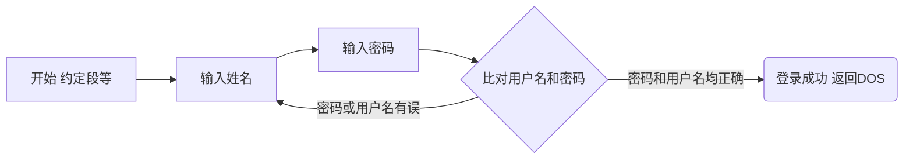

# 用户登录程序

[买验3.18]用户登录验证程序的实现。
程序执行后,给出操作提示，请用户输人用户名和密码;用户在输人密码时，程序不
回显输入字符;只有当用户输人的用户名、 密码字符串和程序内定的字符串相同时，才显示欢迎界面，并返回DOS。 界面颜色自定(彩色或黑白)。

- 使用BIOS中断显示界面： [exa318R1.ASM](exa318R1.ASM)
- 被老师要求后修改程序流程之后的代码，使用宏来简化两个字符串的比较，使用DOS显示中断： [exa318R2.ASM](exa318R2.ASM)

## 程序执行流程图



## 字符串比较流程图

```MERMAID
graph LR
l1(str1长度)-->j1{比较长度是否一致}
l2(str2长度)-->j1
j1-->|不一致|ed
j1-->|一致|j2
s1(str1首地址)-->j2{比较字符是否相等}
s2(str2首地址)-->j2
j2-->|字符相同|op[修改两个寄存器使之指向下一个字符]
j2-->|字符不同|ed(结束 字符串不等)
op-->|比较下一个字符|j2
j2-->|所有字符都相同|ed2(结束 字符串相等)
```
